# Test Matrix Results: test_matrix_results_20250903_180836

*Generated: 2025-09-11 17:11:46*

## Overview

- **Total Tests**: 5

## Visualization Graphs

### Adam Accuracy Evolution
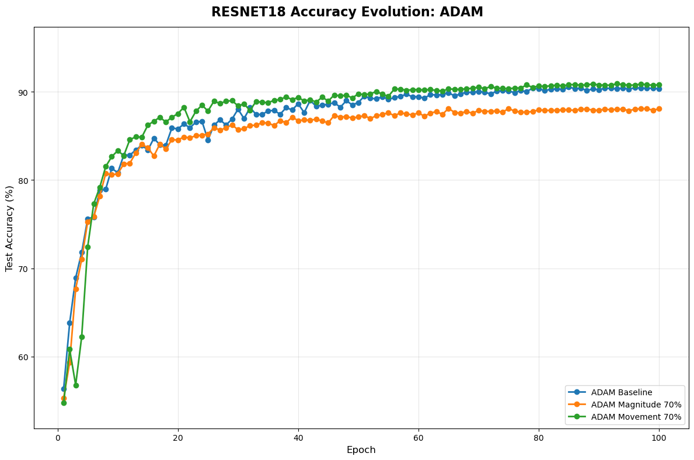

### Adam Model Comparison
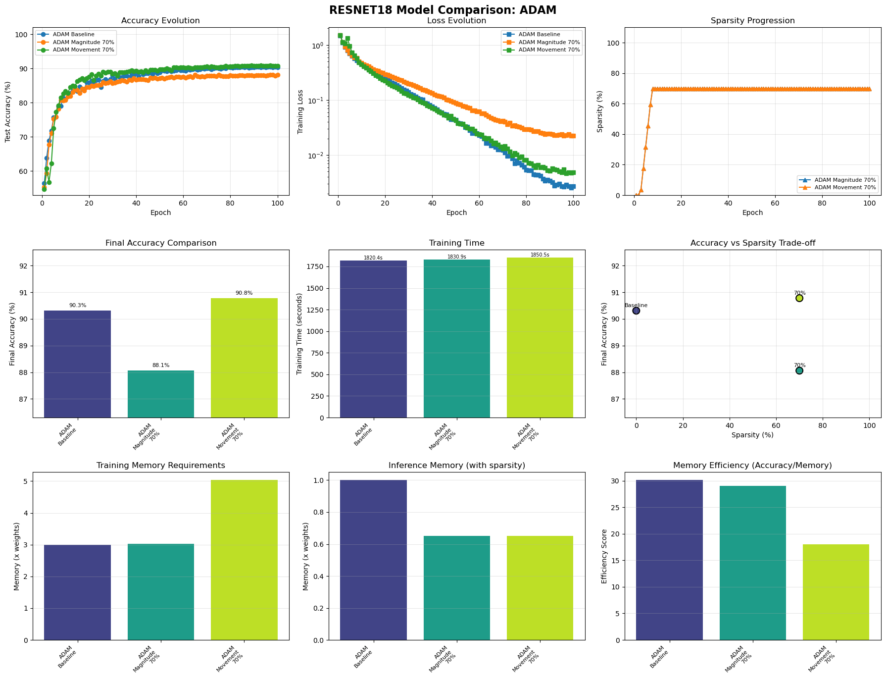

### Adamwprune Accuracy Evolution
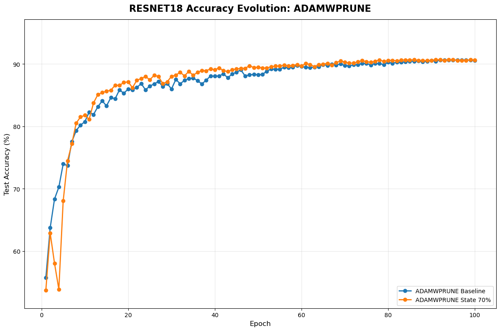

### Adamwprune Model Comparison
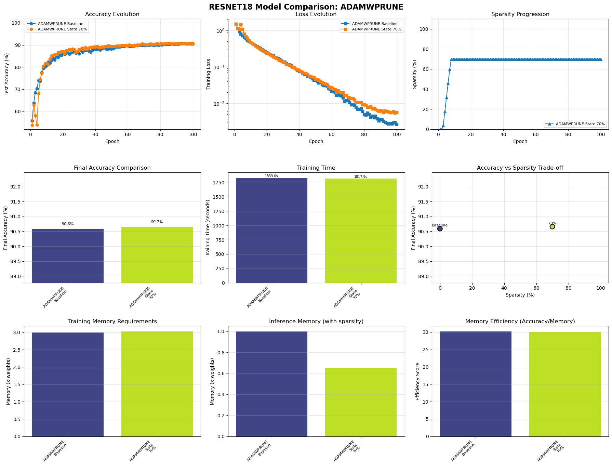

### All Methods Comparison
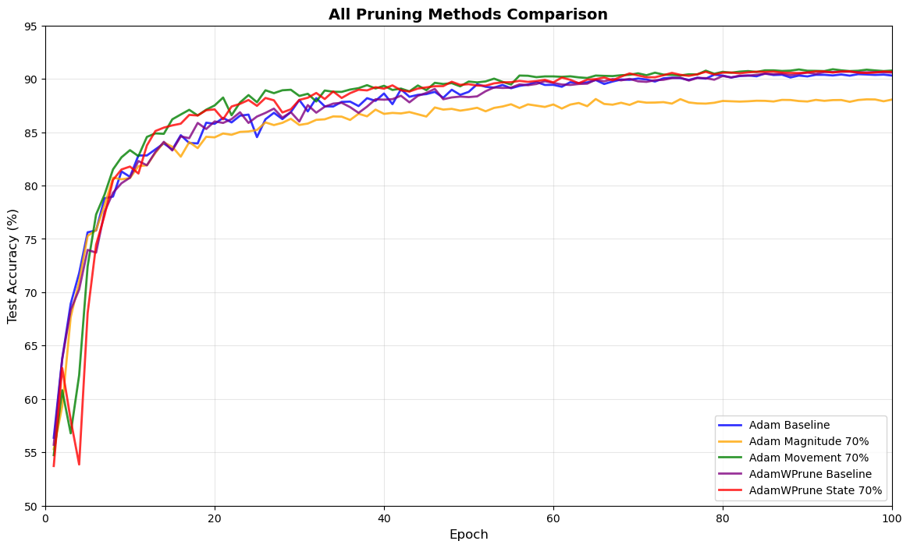

### All Methods Memory Accuracy
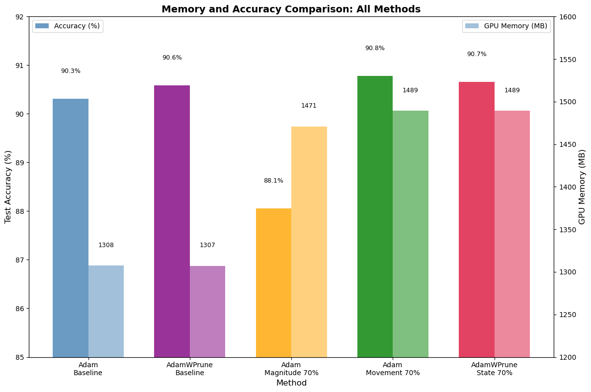

### Gpu Memory Comparison
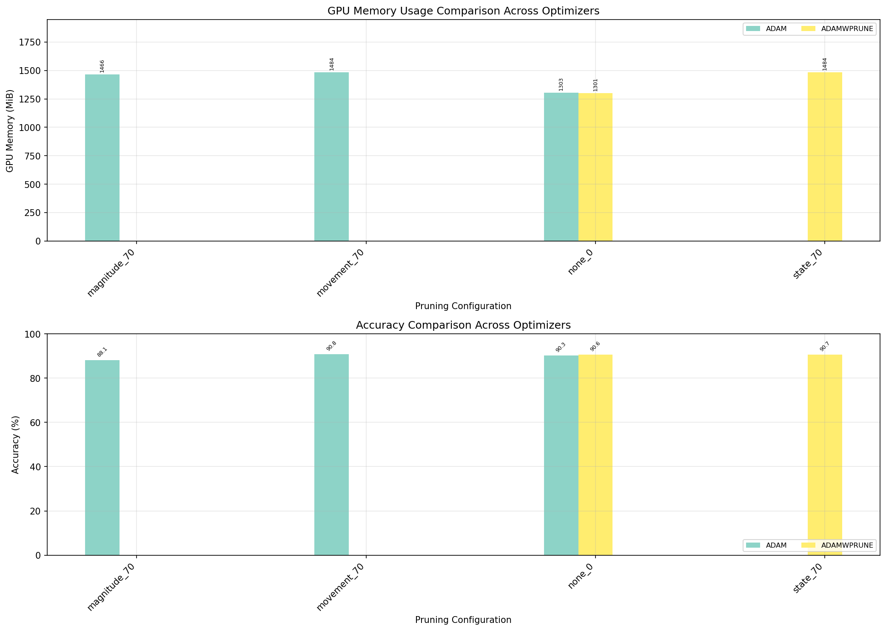

### Gpu Memory Timeline
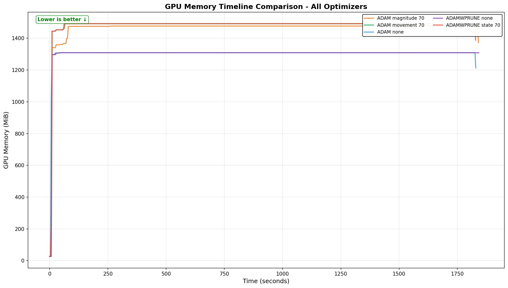

### Memory Vs Accuracy Scatter
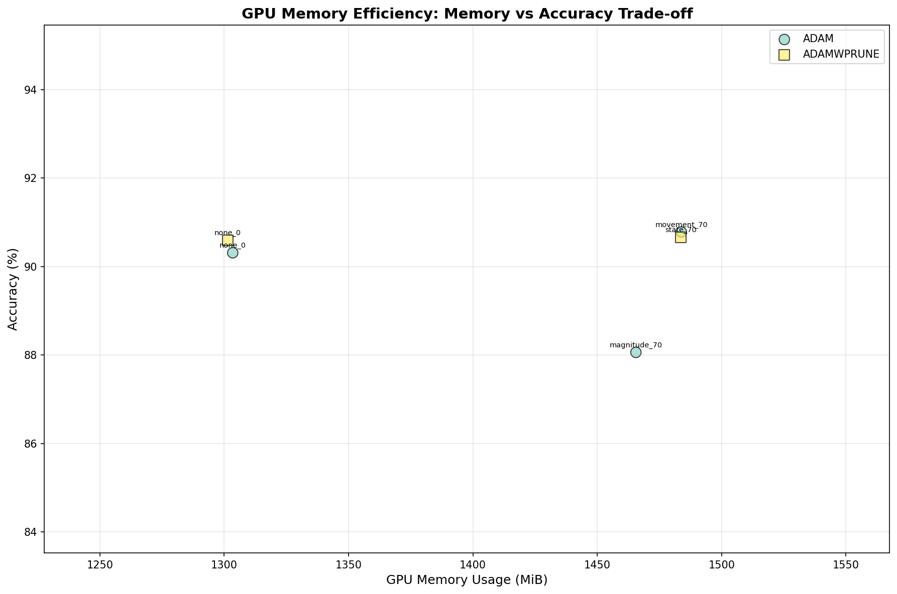

### Training Memory Comparison
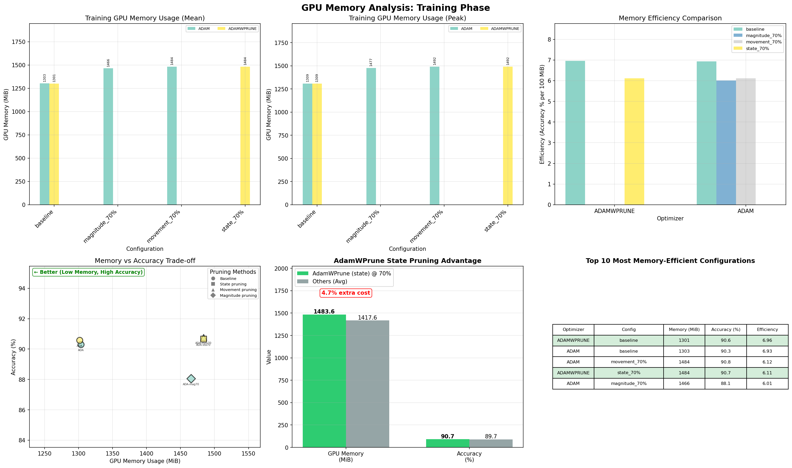

## Detailed Test Results

| Test Configuration | Accuracy | Sparsity | GPU Mean | GPU Max | Training Time |
|-------------------|----------|----------|----------|---------|---------------|

## Individual Training Plots

### resnet18_adam_magnitude_70
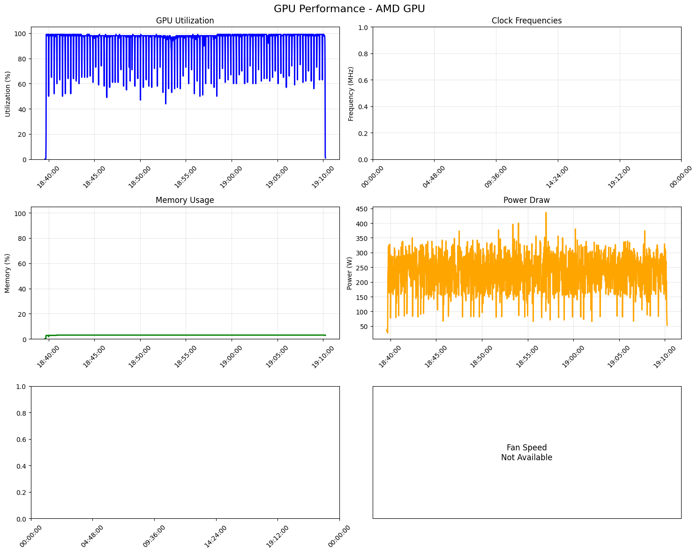

### resnet18_adam_movement_70
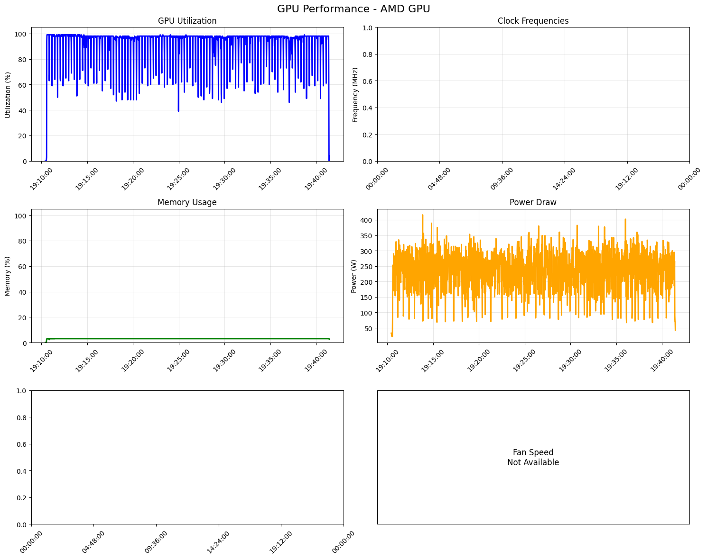

### resnet18_adam_none


### resnet18_adamwprune_none
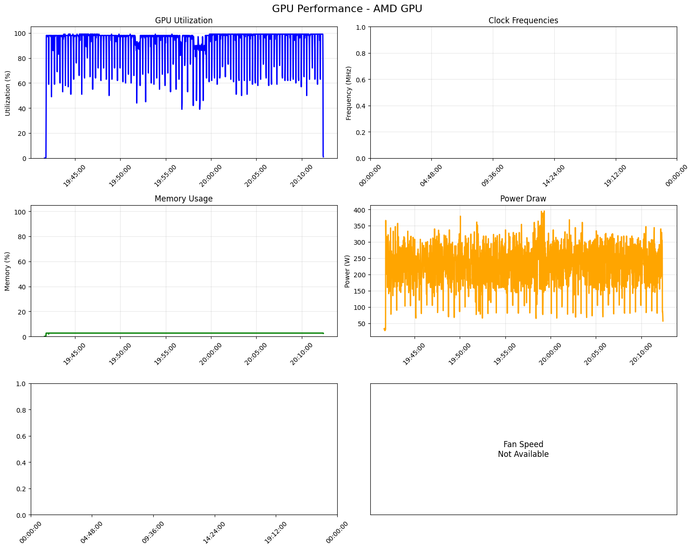

### resnet18_adamwprune_state_70
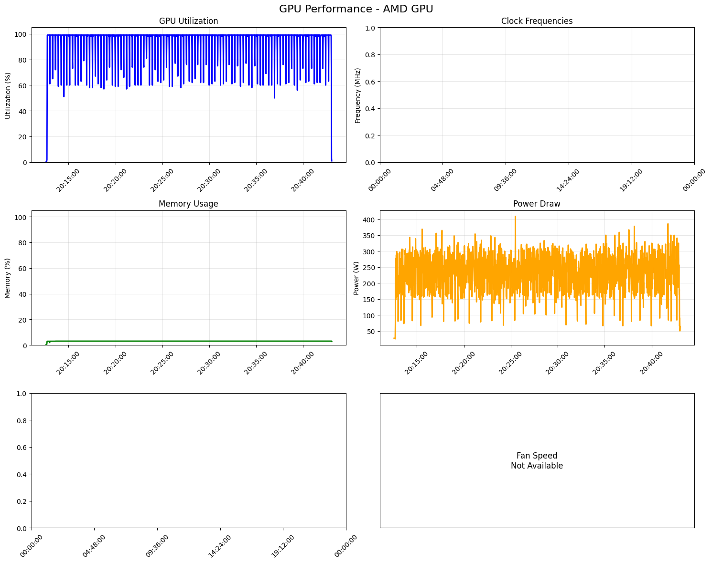

## Summary Report

```
Test Matrix Summary Report (With Real GPU Memory Data)
Generated: 2025-09-03T23:31:17.343898
From: test_matrix_results_20250903_180836
================================================================================

Total tests: 5
Successful: 5
Failed: 0

Results Table:
---------------------------------------------------------------------------------------------------------
Test ID                                  Accuracy Sparsity GPU Mean (MiB) GPU Max (MiB) Status    
---------------------------------------------------------------------------------------------------------
resnet18_adam_movement_70                 90.7800   0.7000         1489.4        1492.0 ✓ Success 
resnet18_adamwprune_state_70              90.6600   0.7000         1489.2        1492.0 ✓ Success 
resnet18_adamwprune_none_0                90.5900   0.0000         1307.2        1309.0 ✓ Success 
resnet18_adam_none_0                      90.3100   0.0000         1307.5        1309.0 ✓ Success 
resnet18_adam_magnitude_70                88.0600   0.7000         1471.0        1477.0 ✓ Success 
---------------------------------------------------------------------------------------------------------

Best Performers:
--------------------------------------------------------------------------------
Top Results by Accuracy:
1. resnet18_adam_movement_70: 90.7800 (GPU: 1489.4 MB)
2. resnet18_adamwprune_state_70: 90.6600 (GPU: 1489.2 MB)
3. resnet18_adamwprune_none_0: 90.5900 (GPU: 1307.2 MB)
4. resnet18_adam_none_0: 90.3100 (GPU: 1307.5 MB)
5. resnet18_adam_magnitude_70: 88.0600 (GPU: 1471.0 MB)

Best by Optimizer:
  adam: resnet18_adam_movement_70 (90.7800, GPU: 1489.4 MB)
  adamwprune: resnet18_adamwprune_state_70 (90.6600, GPU: 1489.2 MB)

GPU Memory Efficiency Analysis (Real Measurements):
--------------------------------------------------------------------------------
Most Memory-Efficient (Accuracy per 100MB GPU):
1. resnet18_adamwprune_none_0
   Accuracy: 90.59%, GPU Memory: 1307.2 MB, Efficiency Score: 6.93
2. resnet18_adam_none_0
   Accuracy: 90.31%, GPU Memory: 1307.5 MB, Efficiency Score: 6.91
3. resnet18_adam_movement_70
   Accuracy: 90.78%, GPU Memory: 1489.4 MB, Efficiency Score: 6.10
4. resnet18_adamwprune_state_70
   Accuracy: 90.66%, GPU Memory: 1489.2 MB, Efficiency Score: 6.09
5. resnet18_adam_magnitude_70
   Accuracy: 88.06%, GPU Memory: 1471.0 MB, Efficiency Score: 5.99

Lowest GPU Memory Usage:
1. resnet18_adamwprune_none_0
   GPU Memory: 1307.2 MB (max: 1309.0 MB), Accuracy: 90.59%
2. resnet18_adam_none_0
   GPU Memory: 1307.5 MB (max: 1309.0 MB), Accuracy: 90.31%
3. resnet18_adam_magnitude_70
   GPU Memory: 1471.0 MB (max: 1477.0 MB), Accuracy: 88.06%
4. resnet18_adamwprune_state_70
   GPU Memory: 1489.2 MB (max: 1492.0 MB), Accuracy: 90.66%
5. resnet18_adam_movement_70
   GPU Memory: 1489.4 MB (max: 1492.0 MB), Accuracy: 90.78%

AdamWPrune Performance (Real GPU Measurements):
--------------------------------------------------------------------------------
Configuration: resnet18_adamwprune_none_0
  Accuracy: 90.59%
  Sparsity achieved: 0.0%
  GPU Memory (mean): 1307.2 MB
  GPU Memory (peak): 1309.0 MB
  Memory savings vs others: 115.5 MB (8.1%)
Configuration: resnet18_adamwprune_state_70
  Accuracy: 90.66%
  Sparsity achieved: 70.0%
  GPU Memory (mean): 1489.2 MB
  GPU Memory (peak): 1492.0 MB
  Memory savings vs others: -66.5 MB (-4.7%)

GPU Memory Comparison (All Optimizers):
  adam        :  1422.6 MB (avg of 3 runs)
  adamwprune  :  1398.2 MB (avg of 2 runs)

```

## Key Findings

