# Test Matrix Results: test_matrix_results_20250908_121537

*Generated: 2025-09-11 17:11:46*

## Overview

- **Total Tests**: 0

## Visualization Graphs

### Adam Accuracy Evolution
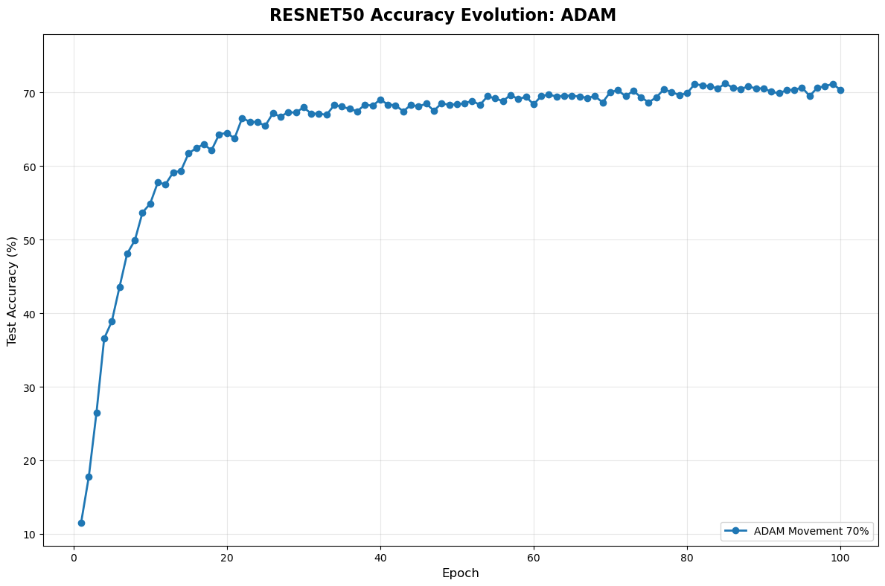

### Adam Model Comparison


### Adamw Accuracy Evolution
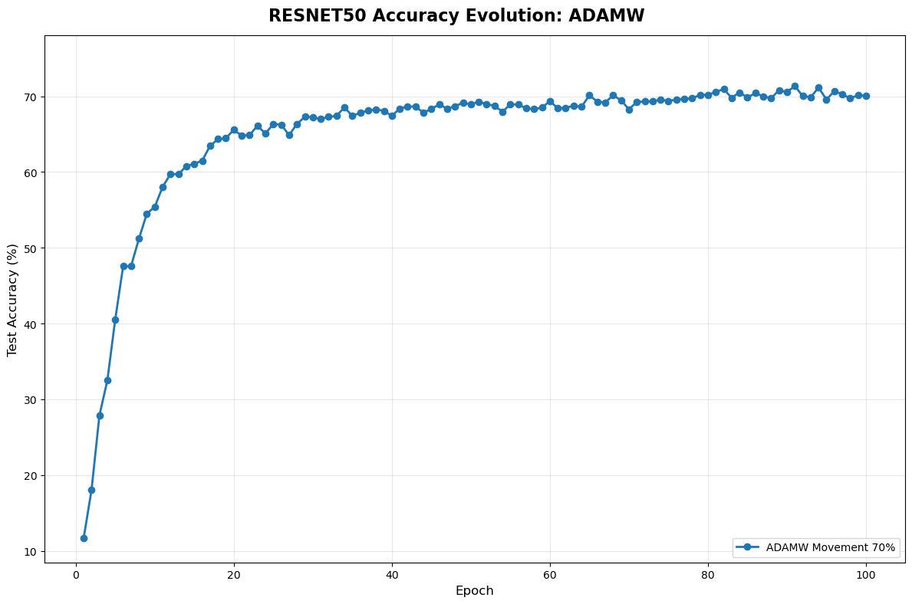

### Adamw Model Comparison
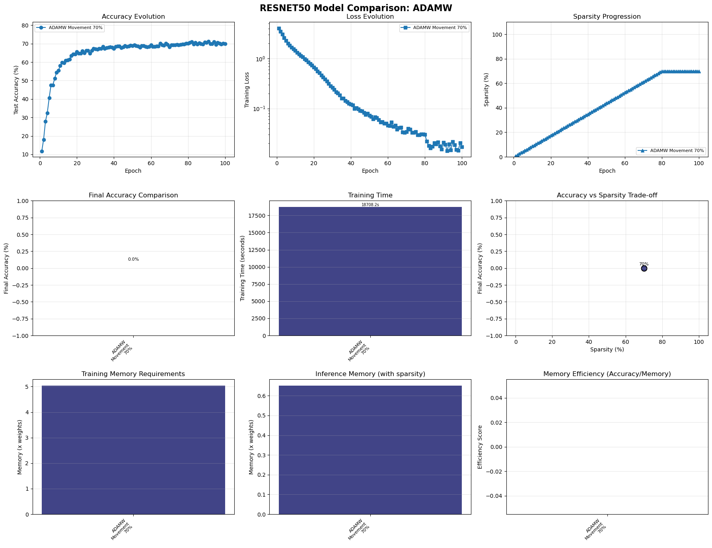

### Adamwadv Accuracy Evolution
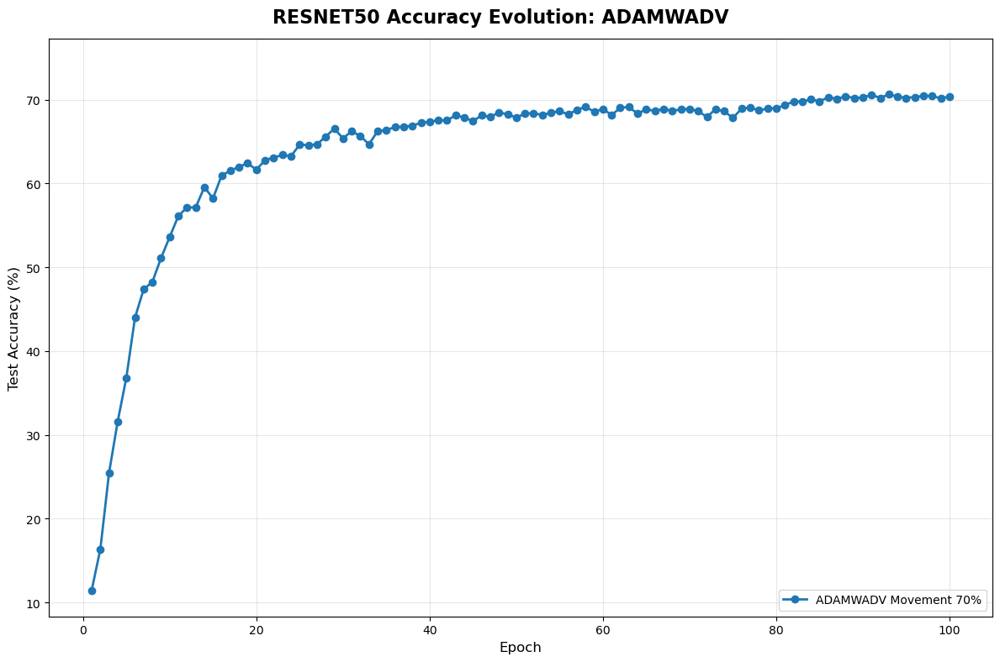

### Adamwadv Model Comparison


### Adamwprune Accuracy Evolution
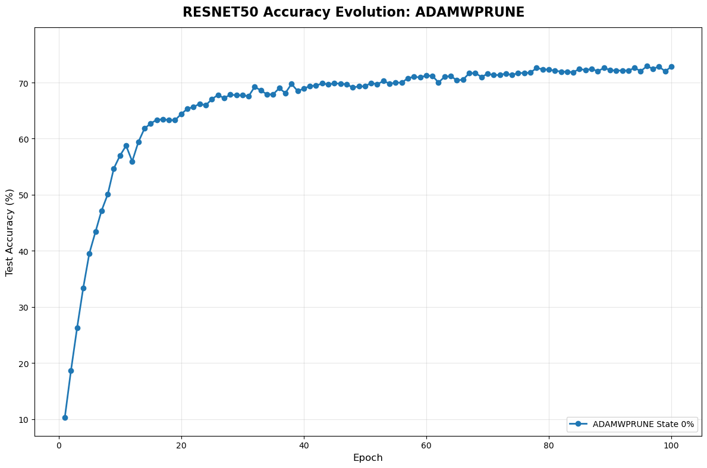

### Adamwprune Model Comparison
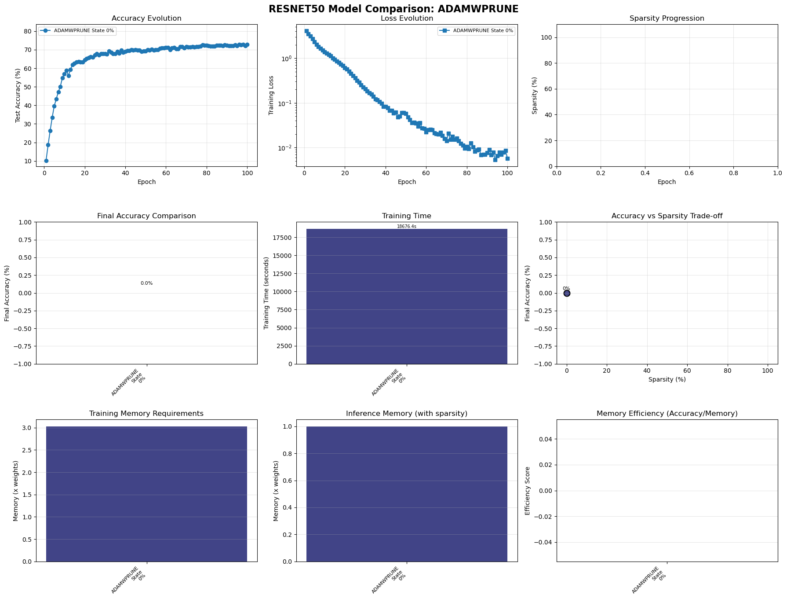

### Adamwspam Accuracy Evolution


### Adamwspam Model Comparison
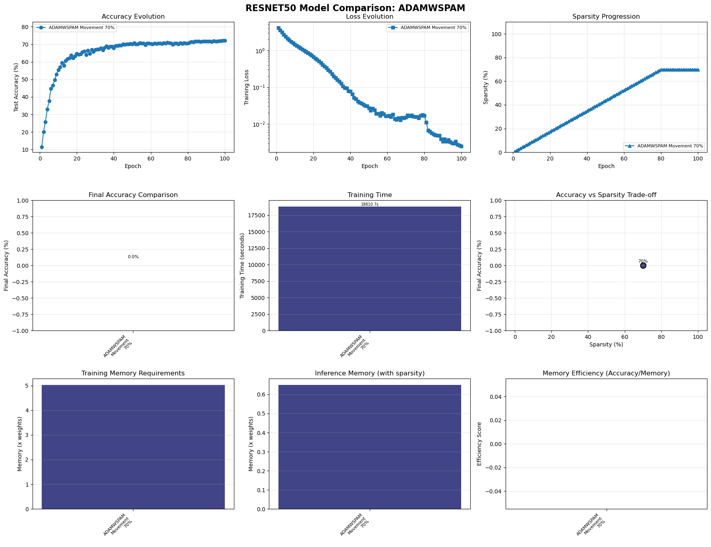

### Gpu Memory Comparison
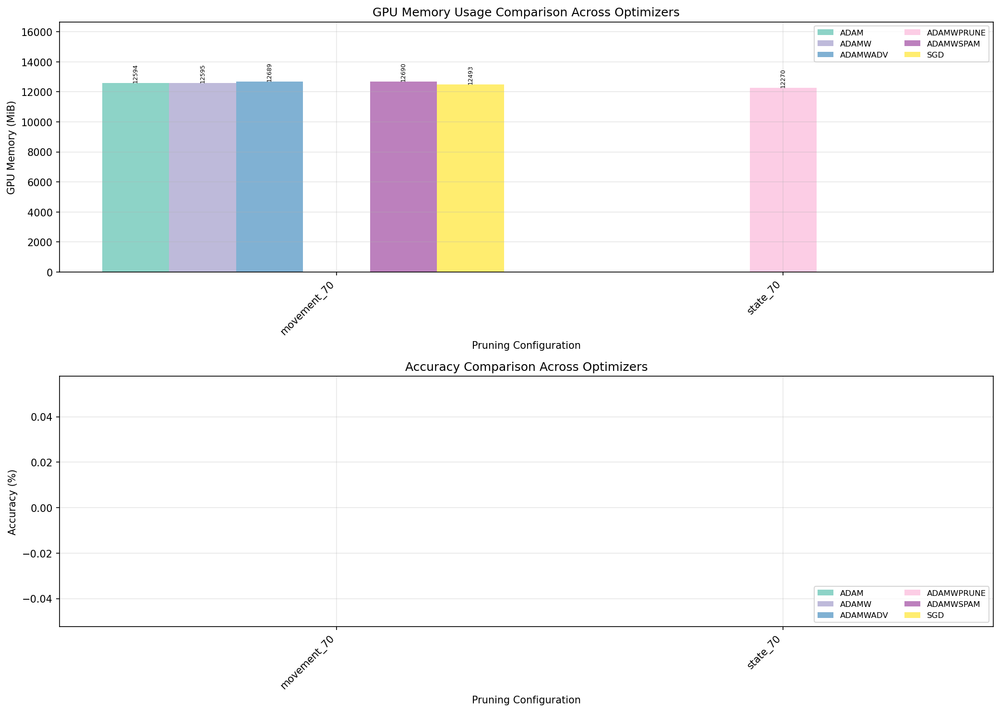

### Gpu Memory Timeline
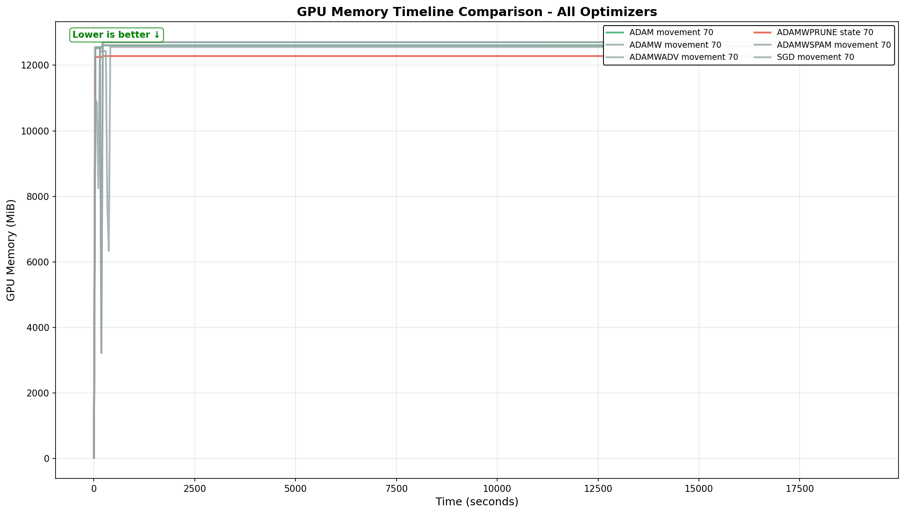

### Memory Vs Accuracy Scatter
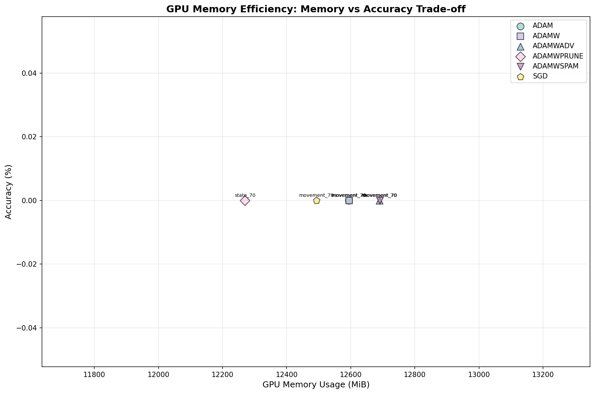

### Sgd Accuracy Evolution
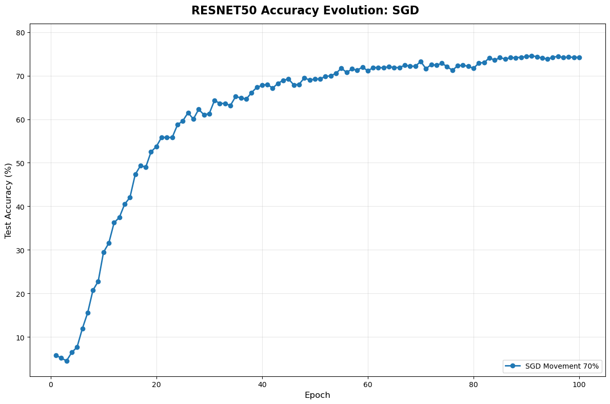

### Sgd Model Comparison


### Training Memory Comparison
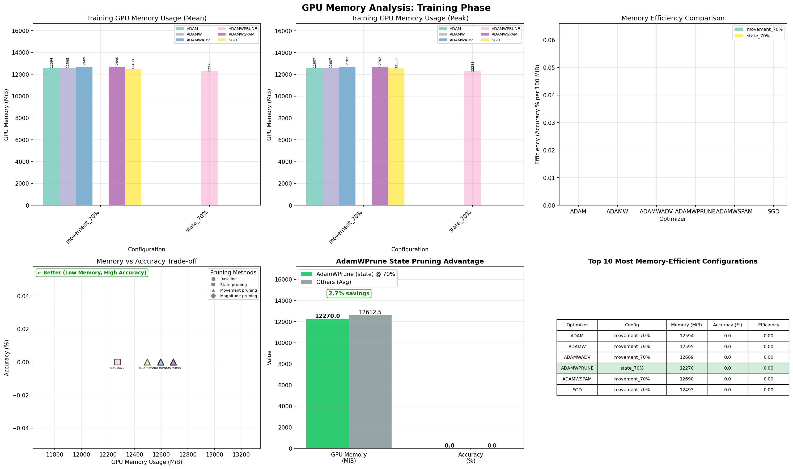

## Detailed Test Results

| Test Configuration | Accuracy | Sparsity | GPU Mean | GPU Max | Training Time |
|-------------------|----------|----------|----------|---------|---------------|

## Individual Training Plots

## Summary Report

```
Test Matrix Summary Report (With Detailed Analysis)
Generated: 2025-09-11T17:05:12.018649
From: test_matrix_results_20250908_121537
================================================================================

Total tests: 6
Successful: 6
Failed: 0

Detailed Results Table:
------------------------------------------------------------------------------------------------------------------------
Test ID                                  Best Acc   Final Acc  Epoch    Sparsity   GPU (MB)     Status    
------------------------------------------------------------------------------------------------------------------------
resnet50_sgd_movement_70                 74.57%     74.26%     @91      70.0%      12501.1      ✓         
resnet50_adamwprune_state_70             72.61%     70.56%     @63      70.0%      12428.6      ✓         
resnet50_adamwspam_movement_70           72.18%     72.18%     @100     70.0%      12694.1      ✓         
resnet50_adamw_movement_70               71.34%     70.04%     @91      70.0%      12600.0      ✓         
resnet50_adam_movement_70                71.23%     70.37%     @85      70.0%      12600.4      ✓         
resnet50_adamwadv_movement_70            70.65%     70.40%     @93      70.0%      12694.0      ✓         
------------------------------------------------------------------------------------------------------------------------

Accuracy Analysis:
--------------------------------------------------------------------------------
Performance by Optimizer:

ADAM:
  Best accuracy: 71.23% (epoch 85)
  Final accuracy: 70.37%
  Stability (std last 10 epochs): 0.45%
  Degradation from peak: 0.86%

ADAMW:
  Best accuracy: 71.34% (epoch 91)
  Final accuracy: 70.04%
  Stability (std last 10 epochs): 0.56%
  Degradation from peak: 1.30%

ADAMWADV:
  Best accuracy: 70.65% (epoch 93)
  Final accuracy: 70.40%
  Stability (std last 10 epochs): 0.16%
  Degradation from peak: 0.25%

ADAMWPRUNE:
  Best accuracy: 72.61% (epoch 63)
  Final accuracy: 70.56%
  Best at target sparsity: 72.38% (epoch 93)
  Stability (std last 10 epochs): 0.68%
  Degradation from peak: 2.05%

ADAMWSPAM:
  Best accuracy: 72.18% (epoch 100)
  Final accuracy: 72.18%
  Stability (std last 10 epochs): 0.18%

SGD:
  Best accuracy: 74.57% (epoch 91)
  Final accuracy: 74.26%
  Stability (std last 10 epochs): 0.19%
  Degradation from peak: 0.31%


Fair Comparison (at target sparsity):
--------------------------------------------------------------------------------
1. sgd: 74.57% @ epoch 91
2. adamwprune: 72.38% (best at 69% sparsity) @ epoch 63
3. adamwspam: 72.18% @ epoch 100
4. adamw: 71.34% @ epoch 91
5. adam: 71.23% @ epoch 85
6. adamwadv: 70.65% @ epoch 93

GPU Memory Analysis:
--------------------------------------------------------------------------------
Memory Usage Ranking:
1. resnet50_adamwprune_state_70: 12428.6 MB (accuracy: 72.61%)
2. resnet50_sgd_movement_70: 12501.1 MB (accuracy: 74.57%)
3. resnet50_adamw_movement_70: 12600.0 MB (accuracy: 71.34%)
4. resnet50_adam_movement_70: 12600.4 MB (accuracy: 71.23%)
5. resnet50_adamwadv_movement_70: 12694.0 MB (accuracy: 70.65%)

Memory Efficiency (Accuracy per GB):
  adamwprune: 5.98%/GB
  sgd: 6.11%/GB
  adamw: 5.80%/GB
  adam: 5.79%/GB
  adamwadv: 5.70%/GB

```

## Key Findings

